# EcoChallenges

> I made this project as the final CS bagrut project, and got 100 marks from the external examiner.

EcoChallenges is a website that gives users environmental challenges. People start doing tasks, and when they finish them they can rate the challenge and get points. Users compete for who gets the most points by doing challenges.

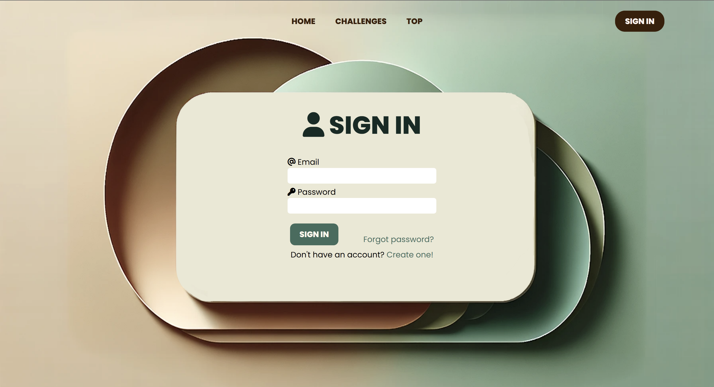
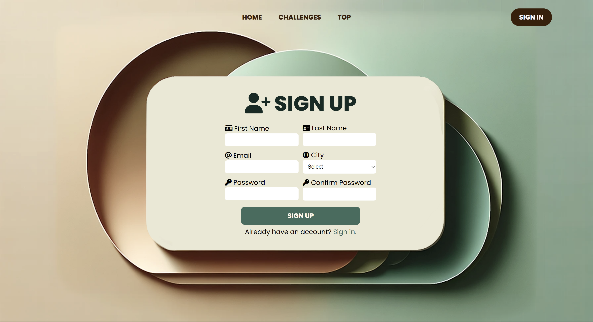
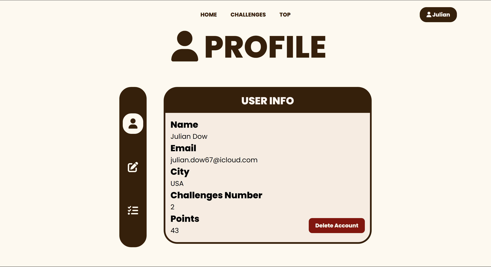
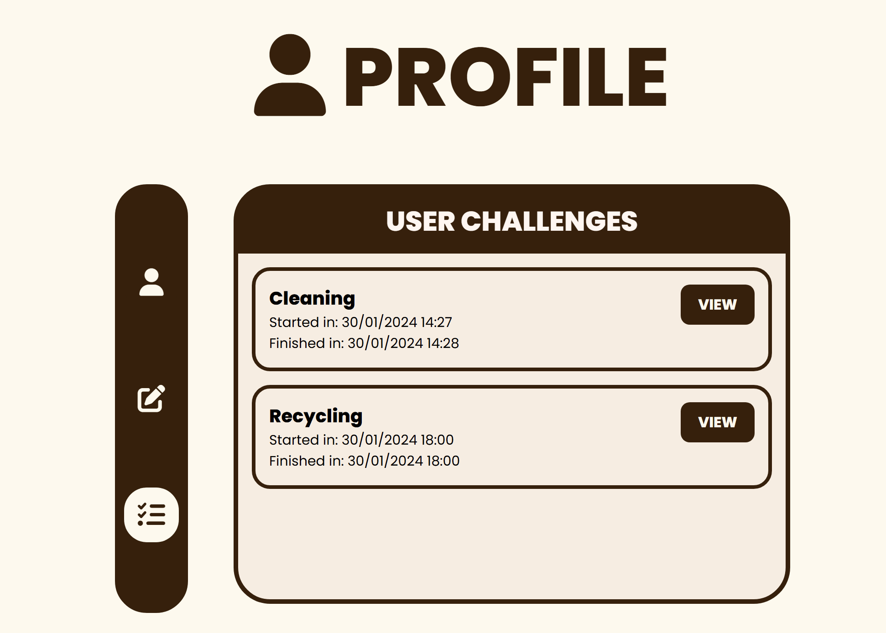
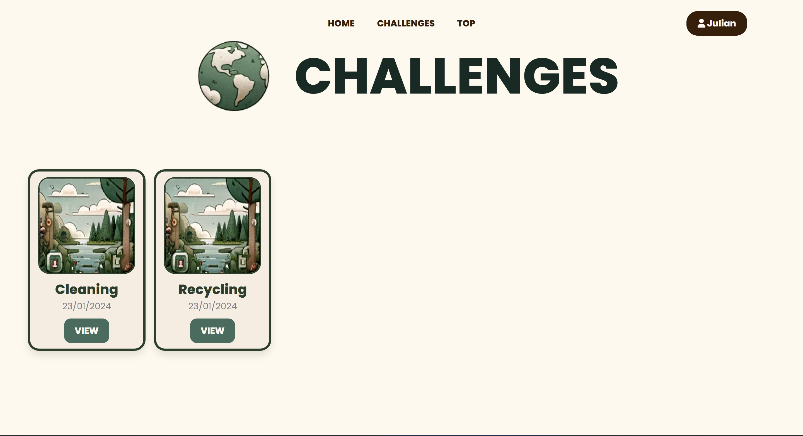
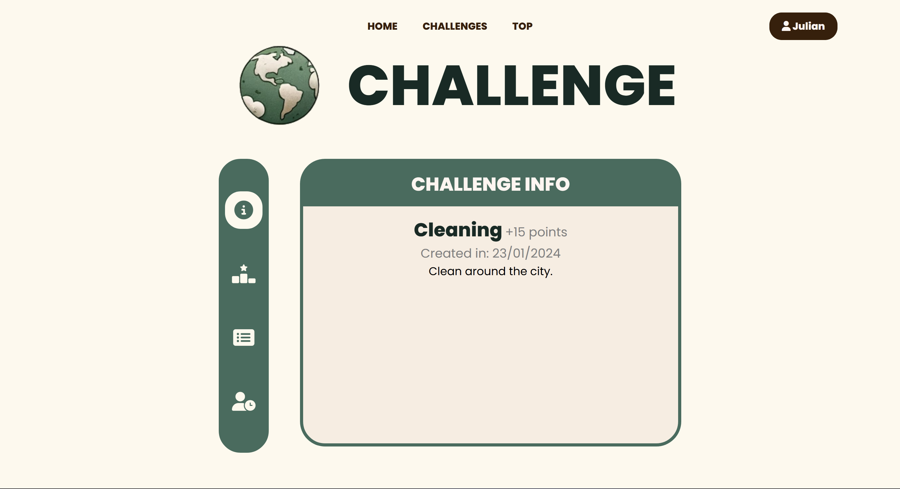
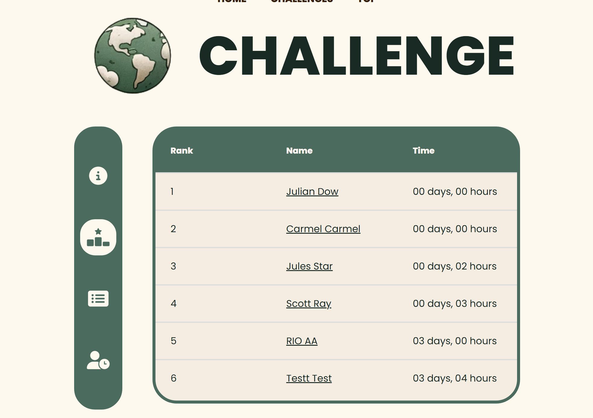
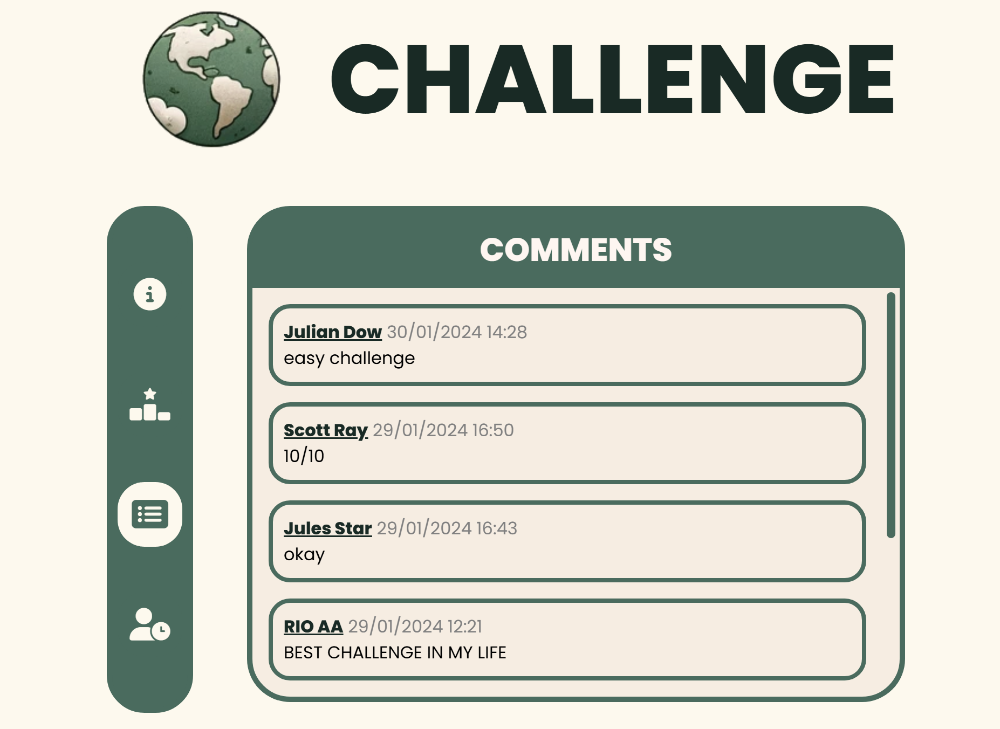
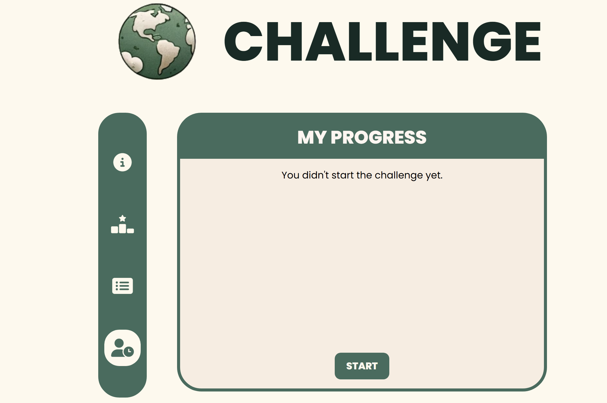
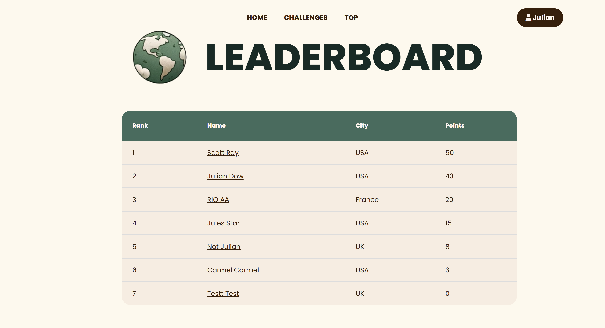
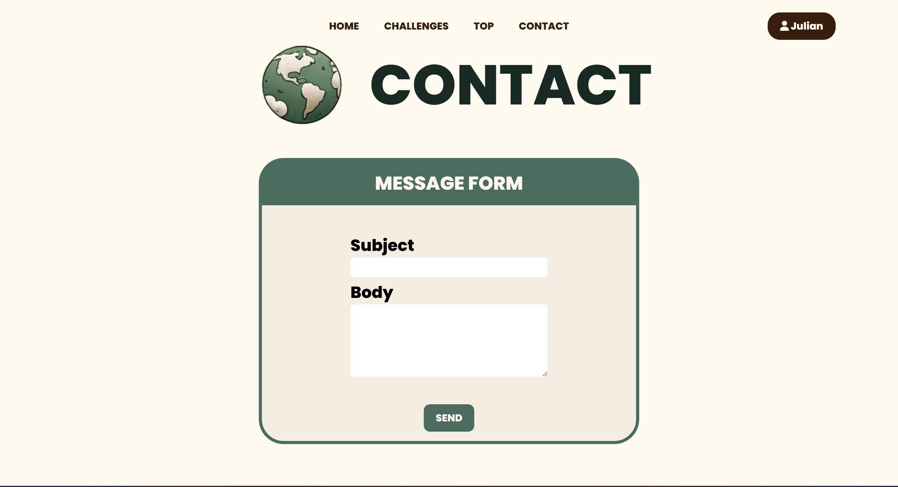
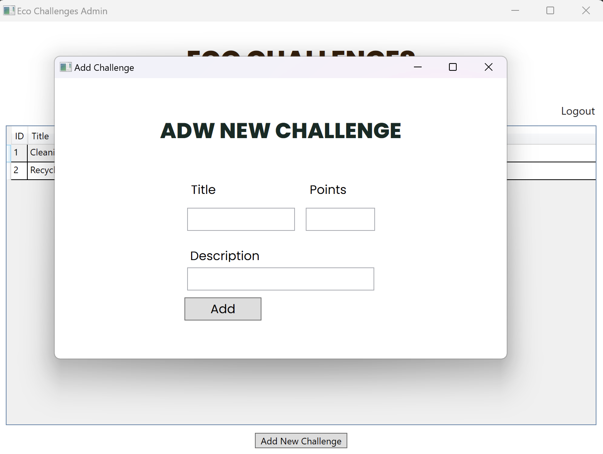
